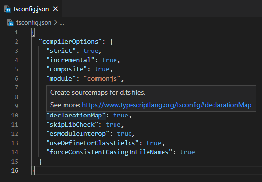

# Config

_What are all these things? Why are they here?_

Even though this repository has only one library package, it contains a number of configuration files which support the development, test, and build tooling. See below for details of each configuration file:
 
  - [`.husky/...`](#husky)
  - [`.eslintrc.js`](#eslintrcjs)
  - [`.gitignore`](#gitignore)
  - [`.prettierrc`](#prettierrc)
  - [`commitlint.config.js`](#commitlintconfigjs)
  - [`jest.config.js`](#jestconfigjs)
  - [`package.json`](#packagejson)
  - [`pnpm-lock.yaml`](#pnpm-lockyaml)
  - [`tsconfig.json`](#tsconfigjson)
  - [`tsconfig.build.json`](#tsconfigbuildjson)
  - [`tsconfig.eslint.json`](#tsconfigeslintjson)
 
### `.husky/`

[Husky](https://typicode.github.io/husky/#/) is a tool for configuring [git hooks](https://git-scm.com/docs/githooks). 

- The `commit-msg` hook evaluates a commit message before allowing the commit to complete. In this repository the hook is configured to use [commitlint](#commitlintconfigjs).
- The `pre-commit` hook ensures all .ts files in `src` and `test` begin with the `LICENSE_HEADER`

### `.eslintrc.js`

[ES Lint](https://eslint.org/) is the dominant [linter](<https://en.wikipedia.org/wiki/Lint_(software)>) for both JavaScript and TypeScript. ES Lint has numerous rules which can be configured, and `.eslintrc.js` files describe which rules to use and how. ES Lint is invoked during development and build steps to ensure code consistency and correctness. With the [right extensions](./SETUP.md#vs-code-extensions) ES Lint is also well integrated into VS Code, so that linting errors can be seen and fixed live while writing code. 

The `parserOptions` section includes settings to ensure ESLint and TypeScript work well together within this repo.
 
### `.gitignore`

This file tells git which files to exclude from source control. For this project the obvious items are the standard exclusion of `node_modules` and the intentional choice to _include_ the `.vscode` folder, because it includes [settings that make linting work](#vs-code-settings-json) well and which we want to share between all developers working on the project.
 
### `.prettierrc`

[Prettier](https://prettier.io/docs/en/index.html) is a library focused exclusively on ergonomic *formatting* of JavaScript, HTML, JSON, YAML, and a variety of other common file formats used in frontend work. Unlike ESLint, it strives to *just work*, with minimal config required or even offered. We do use just three options:

|Setting|Effect|
|-|-|
|`"semi": true`|Ensure our use of semicolons (or not) is consistent across projects.|
|`"singleQuote": true`|Ensure our use of single quotes (or not) is consistent across projects.|
|`"endOfLine":"auto"`|Tell prettier to use the right line breaks for the platform (`\n` for *nix, `\r\n` for windows).|
 
### `commitlint.config.js`

This repository uses [commitlint](https://commitlint.js.org/#/) to enforce some basic rules that ensure all commit messages follow [Convetional Commit](https://www.conventionalcommits.org/en/v1.0.0/#summary) rules, which in turn allows consistent tracking of changes and release notes. `commitlint.config.js` is the configuration file that commitlint uses to know which rules to use. We mostly rely on the standard rules defined in [@commitlint/config-conventional](https://github.com/conventional-changelog/commitlint/tree/master/%40commitlint/config-conventional).

### `jest.config.js`

[Jest](https://jestjs.io/docs) is a test framework runner. It uses the familiar `describe`, `it` pattern for structuring tests and the `expect(...).to__` pattern for making assertions. Where earlier projects often required you to assemble and plug together your own set of tools for testing (`mocha` for test runner, `chai` for assertions, `istanbul` for coverage reports...), Jest brings all the necessary parts to the table and generally just works. 

We use the following settings:

|Setting|Effect|
|-|-|
|`preset: 'ts-jest'`|Jest understands TypeScript|
|`moduleNameMapper: { ... }`|Define the local [path aliases](./SETUP.md#path-aliases) for the project in a way that Jest understands|
|`collectCoverage: true`|Collect code coverage when running tests|
|`collectCoverageFrom: ['src/**/*.ts']`|Only include .ts files in coverage|
|`coverageDirectory: ...`|Put any coverage report files in the `coverage` directory, which is excluded from source control in [`.gitignore`](#gitignore)|
|`coverageReporters: ['text']`|By default, just produce the console output table of coverage results|

### `package.json`

This is the description of the package and repository, used by all JavaScript package managers (`npm`, `yarn`, and `pnpm`). It includes metadata about the repository and lists the dependencies needed to build, test, and run the projects in it. It also includes scripts that can be used in the development process. See [`package.json` docs](https://docs.npmjs.com/files/package.json.html) for more details. As noted in the [SETUP.md](./SETUP.md), we use `pnpm` in this project for package management (`pnpm install`) and for workflow scripts (`pnpx jest`, `pnpm test`, etc.).

### `pnpm-lock.yaml`

As noted in the [SETUP.md](./SETUP.md#quick-start), this project use **pnpm** instead of **npm** for package management. `pnpm-lock.yaml` is the file that pnpm uses to keep track of the exact version of any downstream dependencies that are installed.
  
### `tsconfig.json`

The essential configuration file for the TypeScript compiler and tooling.   

VS Code includes built-in intellisense hints for tsconfig files. To learn what any setting does, just hover over the property name, then click the link in the info box:

|Setting|Effect|
|-|-|
|`compilerOptions.baseUrl: "."`|Relative file path imports within this project directory should be resolved relative to the same directory in which this `tsconfig.json` file is stored
|`compilerOptions.paths: {...}`|Configuration of [path aliases](./SETUP.md#path-aliases) for the project|
|`include: ["./src", "./test"]`|Include both `./src` and `./test` directories for compilation and **tooling support**. Note that the `tsconfig.build.json` configuration used to **build** the project does not include the test files.|
   
### `tsconfig.build.json`

This variation imports and adjusts the settings in `tsconfig.js` to a configuration suited for **building**, which means compiling the *.ts source files in the `src/` directory of the applicable project, and writing the resulting `.js`, `.js.map`, `.d.ts`, and `.d.ts.map` files to the local `dist` folder for the project. The contents of `dist` are never checked in to source control, but they are included in the published npm package for each project.

### `tsconfig.eslint.json`

A slight variation of `tsconfig.json` that tells ESLint to also lint the JavaScript configuration files such as `.eslintrc.js` and `jest.config.js`. If we don't do this, ESLint will complain because it will notice those files but also note that they are not included for compilation by the TypeScript project as described in `tsconfig.json`.
 